  
<!-- project overview -->

>
>Tutoron-GPT: Your Personal AI Learning Assistant
Paste a YouTube link and Tutoron-GPT instantly pulls the transcript, distills it into a clear summary, and builds a custom quiz to lock in the concepts.
Powered by adaptive AI, it tailors every explanation to your learning style so you grasp ideas quickly and remember them longer.

> 

  

<!-- System Design -->

### Architecture Diagram

Backend Diagram 

 
   

 Front-end Diagram  
 
  

DOCKER Diagram 
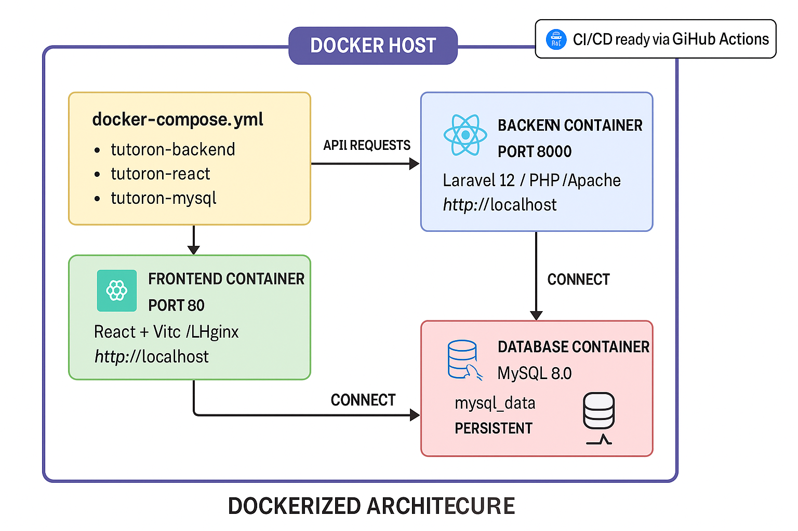

  

### Database Diagram

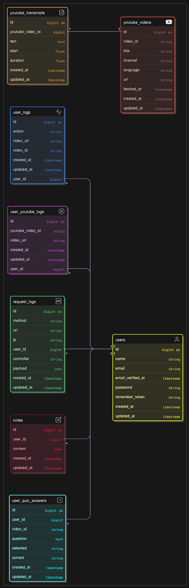
### 🧠 Hybrid Cloud-to-Local Transcript Fetching Architecture

-- **Why:**  
  Cloud VMs like EC2 are often blocked from accessing YouTube transcripts due to IP-based restrictions.

- **The Challenge:**  Fetching YouTube transcripts directly from a server results in failure or empty responses.

- **The Solution:**  Offload the transcript extraction to your **local machine with a residential IP**.

- **How It Works:**   - 🌐 Laravel (on EC2) sends an HTTP POST to a public Ngrok endpoint.  
  - 🧩 Ngrok tunnels the request to your **local Node.js + Express** server.  
  - 🐍 Node.js triggers a Python script (`fetch_transcript.py`) to extract the transcript.  
  - 📬 The response is sent back to **Laravel via a secure HTTP route**, completing the flow.

> ✅ This hybrid architecture enables **fast**, **secure**, and **reliable** transcript access even from cloud-restricted environments.

  

<!-- Project Highlights -->
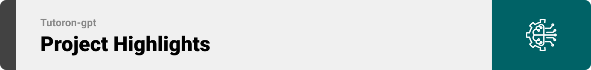
###  Standout Features That Make Tutoron-GPT Shine

-  **One-link to learning flow**  
 Paste any YouTube URL → auto-grab transcript → AI distills a crystal-clear summary → instant multiple-choice quiz.

  **Auto-Quiz Builder**  
  GPT-4 reads the freshly-pulled transcript, then writes a clean JSON quiz,10+ unique, section-tagged questions with answer keys ready for instant display in the frontend 
  -  **Smart AI Summarization**  
  Structured video breakdowns: Objectives, Key Points, Highlights, and Insights - powered by GPT.
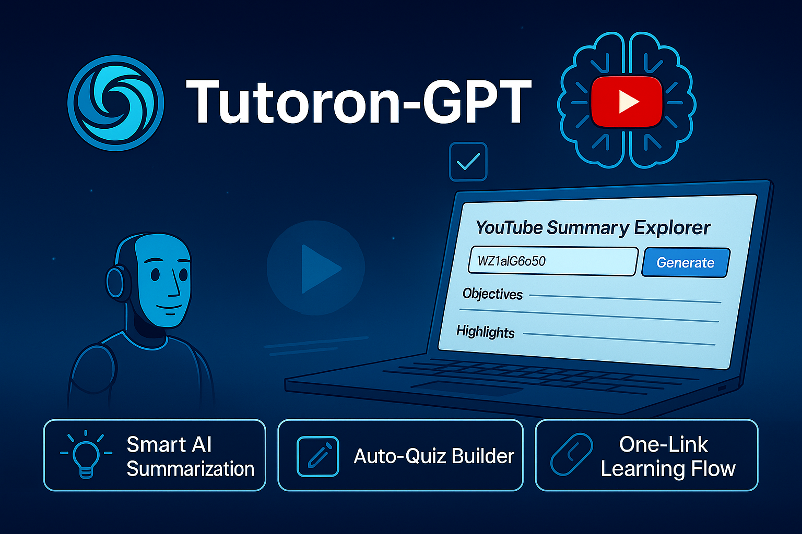

  

<!-- Demo -->

### User Screens (Responsive)
<!-- | Login screen                            | Register screen                       |  Homepage screen                       |
| --------------------------------------- | ------------------------------------- | ------------------------------------- |
| .gif) | .gif )| .gif) |
 -->**Login screen**
.gif) 
**Register screen**
.gif )
**Homepage screen**
.gif)
### user Screen (Web)

<!-- | upload screen                            | Summary screen                       |
| --------------------------------------- | ------------------------------------- |
| 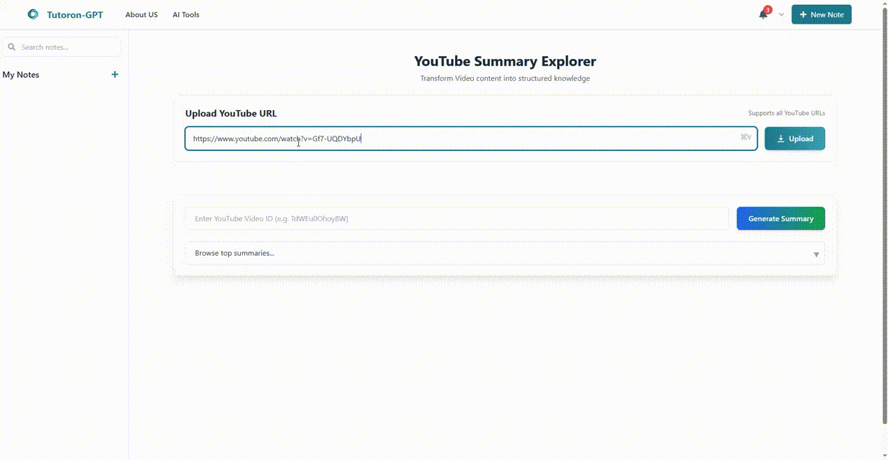 |  | -->

**upload screen**

**Summary screen**

**Quiz**

  
 
<!-- Development & Testing -->

### 

<!-- | Services                            | Validation                       | Testing                        |
| --------------------------------------- | ------------------------------------- | ------------------------------------- |
| 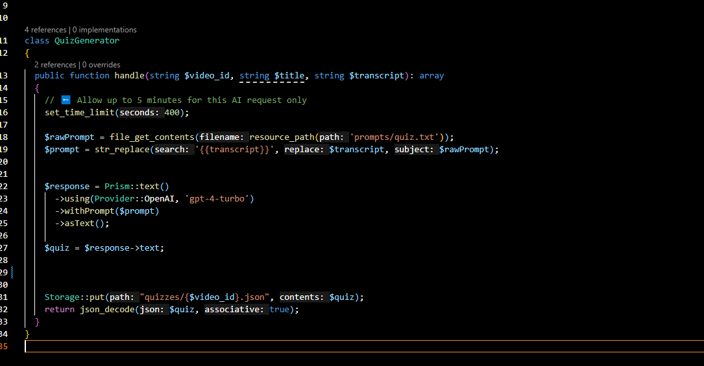 | 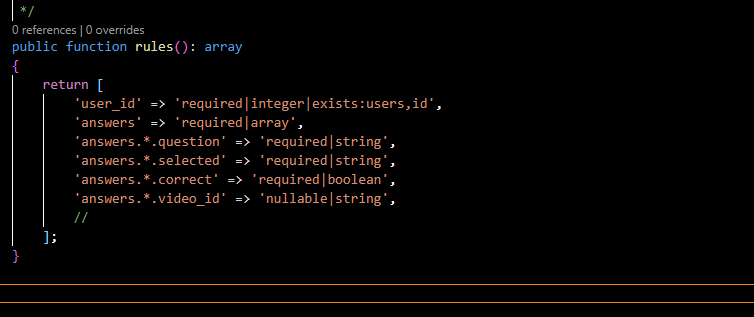 | 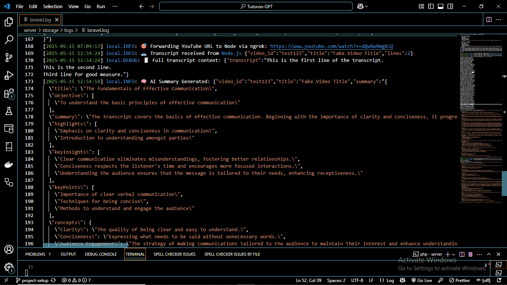 | -->

**Services**

**Validation**
 

 **Testing**
 

**Cloud-Local-Server**
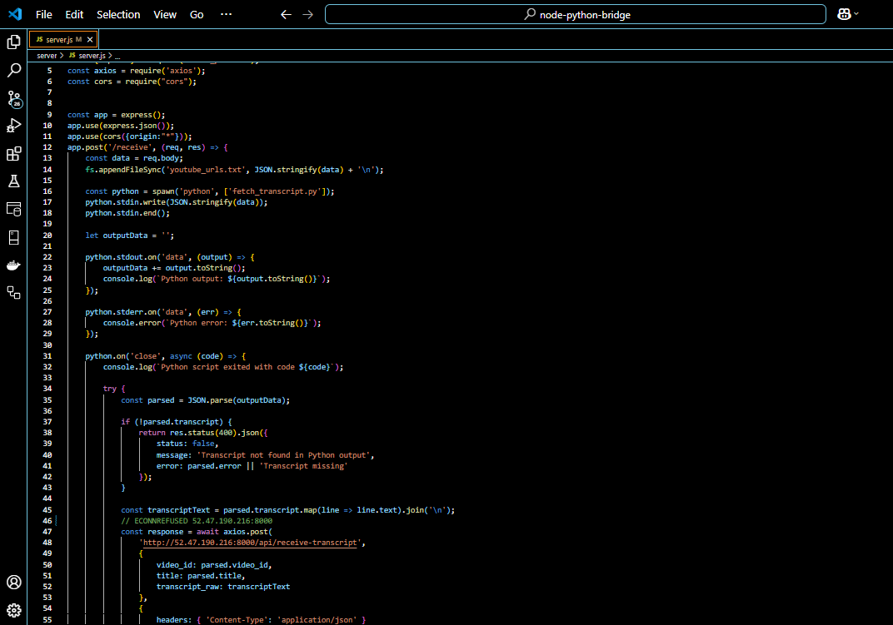

**Fetch-Transcript**
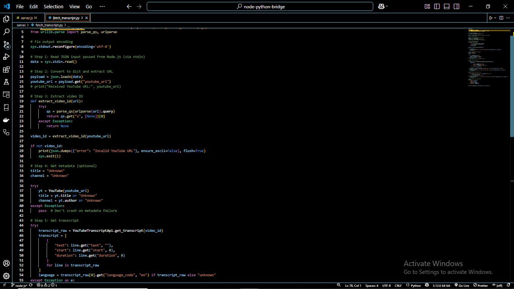

  

### AI Processing Pipeline (Prism + OpenAI GPT-4 Turbo)

- **User Inputs YouTube URL       ↓
Laravel Controller receives URL
         ↓
▶ shell_exec('python fetch_transcript.py')
         ↓
Python script fetches transcript using YouTubeTranscriptAPI
         ↓
Transcript returned to Laravel
         ↓
Prism AI Service handles prompt building
         ↓
→ Sends to OpenAI GPT-4 Turbo (via Prism)
         ↓
Receives structured JSON:
    ├── 🧠 Summary
    └── ✅ Quiz
         ↓
Stored in Laravel:
 ↓
React Frontend fetches data via Axios       ↓
User sees: Summary Viewer + Quiz Viewer**  

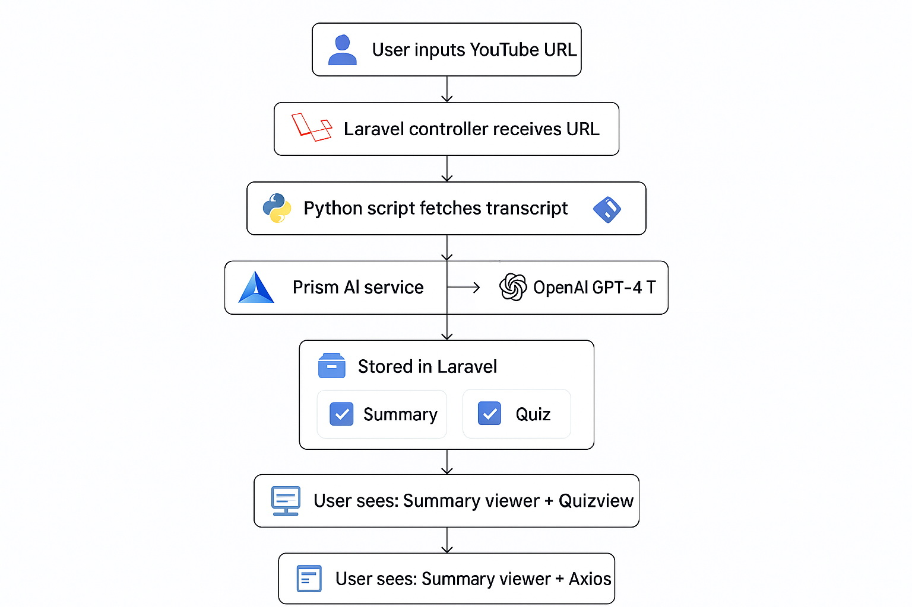 | .png)  |
  

### Prompt sample
(You are an expert AI tutor. Your job is to generate a high-quality multiple-choice quiz from the following transcript.

Each questio
- summary
- keyPointsq
keyInsights
examples
whyItMatters
whatIfNotUsed
useCases
globalBestPractices
stepsToApply 
concepts
Generate at least 10 questions maximum(generate more question if the transcript is too big). Each question must:

- Be linked to one of the above sections using a "section" field
- Include a short, clear "question"
- Provide4 answer choices in an "options" object (keys: a, b, c, d)
- Mark the correct answer using the "correct" key (value: "a", "b", "c", or "d")

Format the final response as a strict valid JSON array like this:

[
  {
    "section": "keyPoints","question": "Which of the following is a key teaching point?",
    "options": {"a": "...",
      "b": "...",
      "c": "...",
      "d": "..."
    },
    "correct": "b"
  },
  ...
] Only output valid JSON — no markdown, no explanation, no text around the output
- Be clear, concise, and accurate
- Use real material from the transcript — no guesswork
- Use unique questions — avoid repetition
- Avoid trick questions; be constructive and educational

Transcript:
{{transcript}}
)
  

<!-- Deployment -->

### Cloud Deployment with CI/CD on Ubuntu EC2 + Docker
- **Automated CI/CD Pipeline**  
- **Dockerized Infrastructure**  
- **Ubuntu EC2 Hosting**  
- **Production Build with Vite + Laravel Artisan**  
- **.env Configuration + Secrets**  
- **Persistent MySQL Volumes**

<!-- | Postman API 1                            | Postman API 2                       | Postman API 3                        |
| --------------------------------------- | ------------------------------------- | ------------------------------------- |
| 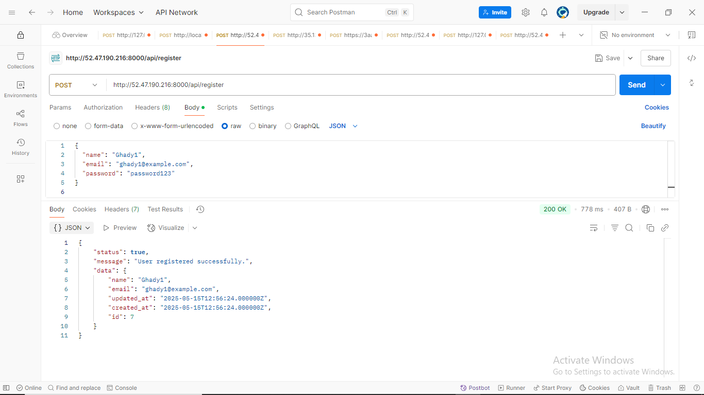 | 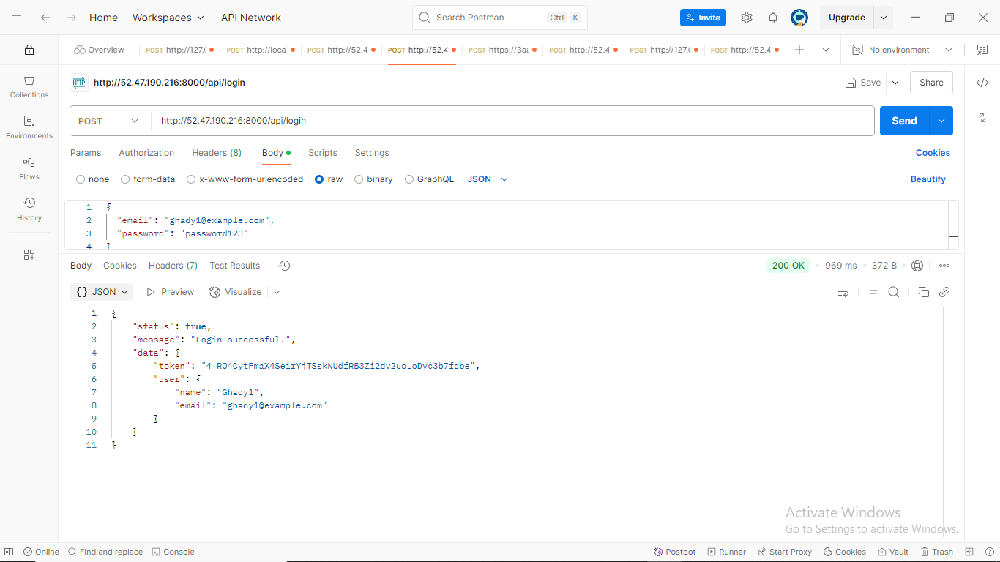 | 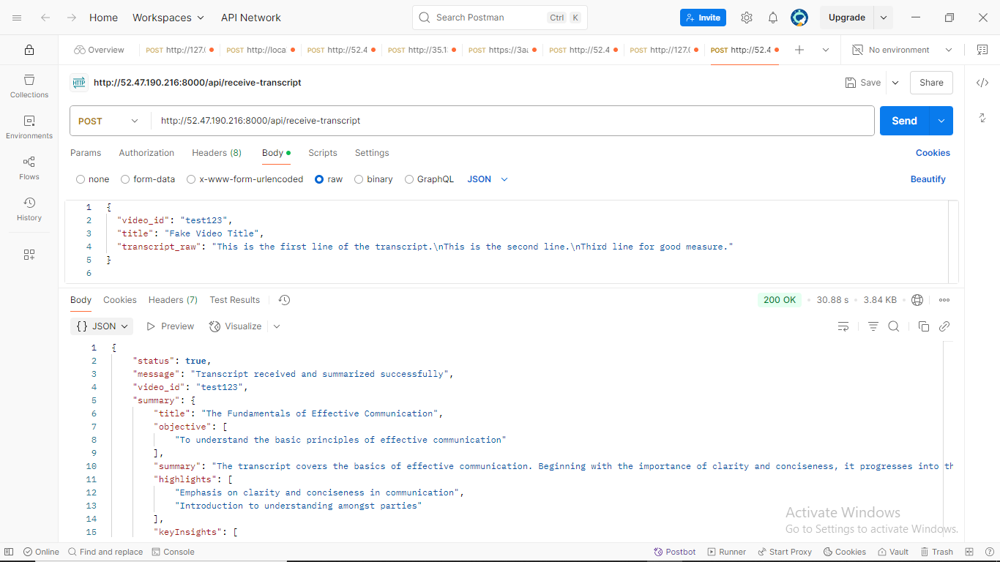 | -->
