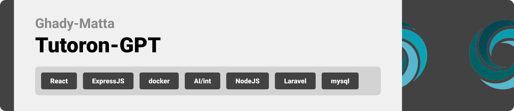
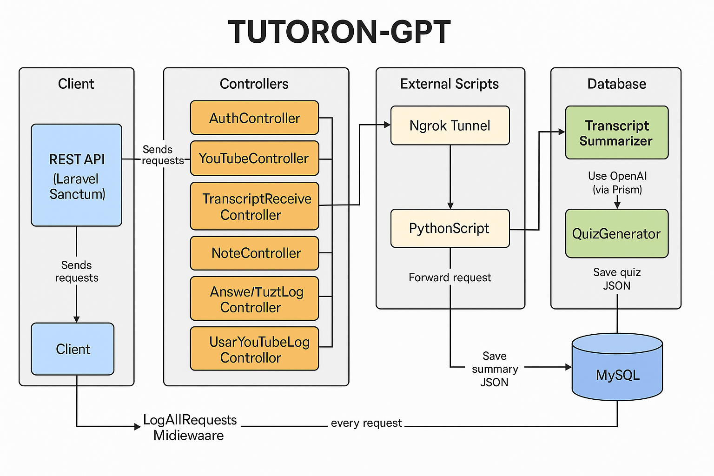
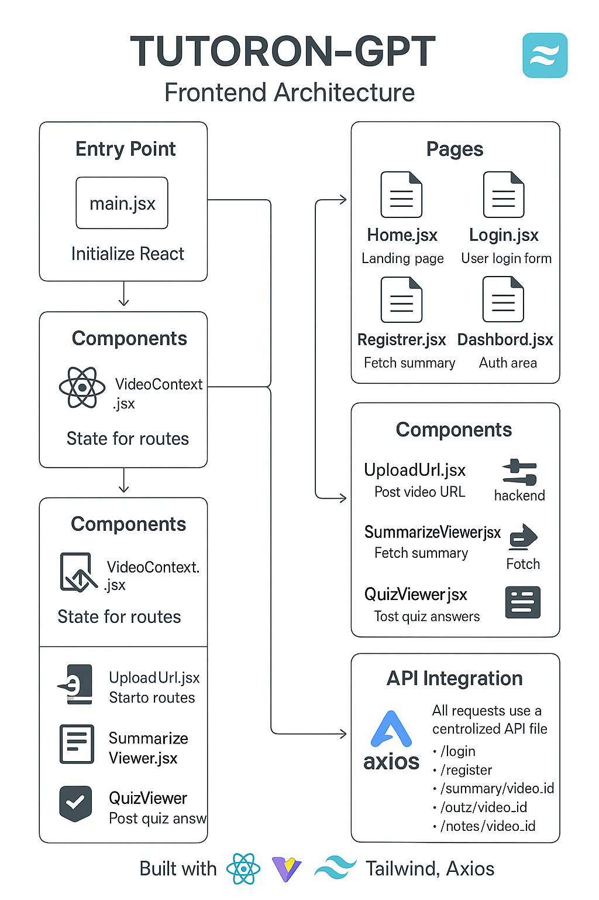

  
<!-- project overview -->

>
>Tutoron-GPT: Your Personal AI Learning Assistant
Paste a YouTube link and Tutoron-GPT instantly pulls the transcript, distills it into a clear summary, and builds a custom quiz to lock in the concepts.
Powered by adaptive AI, it tailors every explanation to your learning style so you grasp ideas quickly and remember them longer.

> 

  

<!-- System Design -->

### Architecture Diagram

Backend Diagram 

 
   

 Front-end Diagram  
 
  

