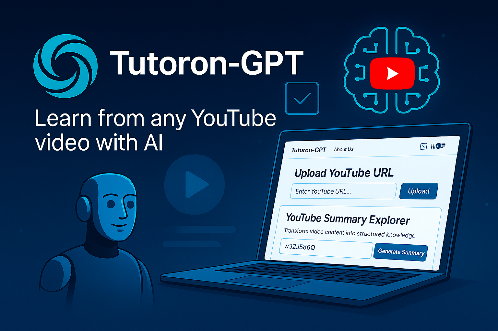
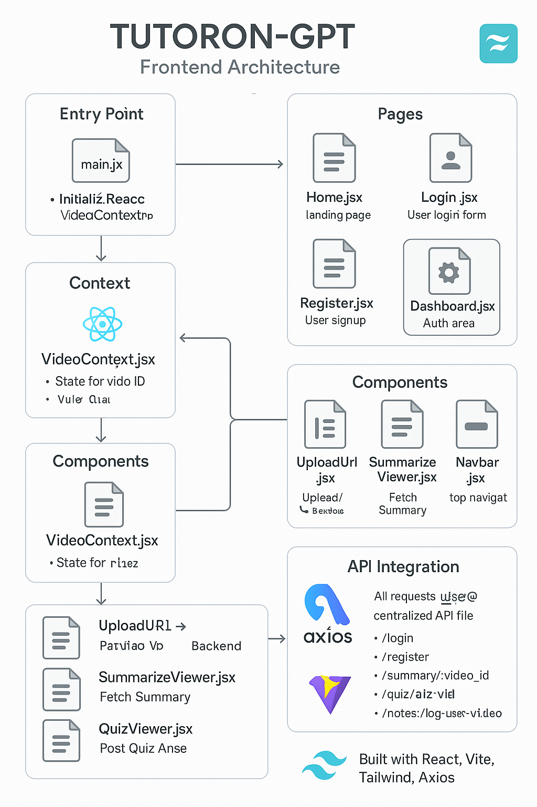
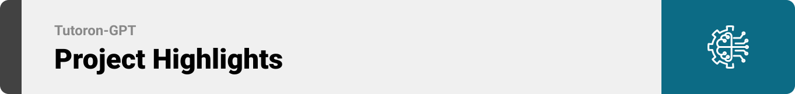

  

<!-- project overview -->

>
>Tutoron-GPT: Your Personal AI Learning Assistant
Tutoron-GPT is an AI-powered education platform designed to revolutionize how individuals learn online. By combining adaptive technology with personalized tutoring experiences, Tutoron-GPT helps users learn faster, understand deeper, and retain longer.

Whether you're a student preparing for exams, a professional upskilling, or a curious mind exploring new topics, Tutoron-GPT tailors its teaching approach to your unique learning style and pace.

> 

  

<!-- System Design -->

### Architecture Diagram

| Backend Diagram                           | front-end Diagram                       |  DOCKER Diagram                       |
| --------------------------------------- | ------------------------------------- | ------------------------------------- |
|  | |  |

  

### Database Diagram

### 🧠 Hybrid Cloud-to-Local Transcript Fetching Architecture

-- **Why:**  
  Cloud VMs like EC2 are often blocked from accessing YouTube transcripts due to IP-based restrictions.

- **The Challenge:**  
  Fetching YouTube transcripts directly from a server results in failure or empty responses.

- **The Solution:**  
  Offload the transcript extraction to your **local machine with a residential IP**.

- **How It Works:**  
  - 🌐 Laravel (on EC2) sends an HTTP POST to a public Ngrok endpoint.  
  - 🧩 Ngrok tunnels the request to your **local Node.js + Express** server.  
  - 🐍 Node.js triggers a Python script (`fetch_transcript.py`) to extract the transcript.  
  - 📬 The response is sent back to **Laravel via a secure HTTP route**, completing the flow.

> ✅ This hybrid architecture enables **fast**, **secure**, and **reliable** transcript access even from cloud-restricted environments.

  

<!-- Project Highlights -->

### 🔥 Standout Features That Make Tutoron-GPT Shine

- 📺 **YouTube Transcript Intelligence**  
  Upload any YouTube URL - get clean transcripts, summaries, key insights, and study material.

- 🌐 **Cloud-to-Local Microservice Bridge**  
  Bypasses YouTube transcript blocking with a hybrid Node.js + Python pipeline using Ngrok.

- 🧠 **Smart AI Summarization**  
  Structured video breakdowns: Objectives, Key Points, Highlights, and Insights - powered by GPT.
  

<!-- Demo -->

### User Screens (Responsive)

| Login screen                            | Register screen                       |  Homepage screen                       |
| --------------------------------------- | ------------------------------------- | ------------------------------------- |
| .gif) | .gif )| .gif) |

### user Screen (Web)

| upload screen                            | Summary screen                       |
| --------------------------------------- | ------------------------------------- |
|  |  |

  
 
<!-- Development & Testing -->

### 

| Services                            | Validation                       | Testing                        |
| --------------------------------------- | ------------------------------------- | ------------------------------------- |
|  |  |  |

  

<!-- Deployment -->

### Cloud Deployment with CI/CD on Ubuntu EC2 + Docker

- **Automated CI/CD Pipeline**  
- **Dockerized Infrastructure**  
- **Ubuntu EC2 Hosting**  
- **Production Build with Vite + Laravel Artisan**  
- **.env Configuration + Secrets**  
- **Persistent MySQL Volumes**

| Postman API 1                            | Postman API 2                       | Postman API 3                        |
| --------------------------------------- | ------------------------------------- | ------------------------------------- |
|  |  |  |

  

### AI Processing Pipeline (Prism + OpenAI GPT-4 Turbo)

- **User Inputs YouTube URL
         ↓
Laravel Controller receives URL
         ↓
▶ shell_exec('python fetch_transcript.py')
         ↓
Python script fetches transcript using YouTubeTranscriptAPI
         ↓
Transcript returned to Laravel
         ↓
Prism AI Service handles prompt building
         ↓
→ Sends to OpenAI GPT-4 Turbo (via Prism)
         ↓
Receives structured JSON:
    ├── 🧠 Summary
    └── ✅ Quiz
         ↓
Stored in Laravel:
 ↓
React Frontend fetches data via Axios
         ↓
User sees: Summary Viewer + Quiz Viewer**  

 | .png)  |
  

### Prompt sample
(You are an expert AI tutor. Your job is to generate a high-quality multiple-choice quiz from the following transcript.

Each question must be directly tied to one of the following core educational sections extracted from the transcript:

- summary
- keyPoints
- keyInsights
- examples
- whyItMatters
- whatIfNotUsed
- useCases
- globalBestPractices
- stepsToApply
- concepts

Generate at least 10 questions maximum(generate more question if the transcript is too big). Each question must:

- Be linked to one of the above sections using a "section" field
- Include a short, clear "question"
- Provide 4 answer choices in an "options" object (keys: a, b, c, d)
- Mark the correct answer using the "correct" key (value: "a", "b", "c", or "d")

Format the final response as a strict valid JSON array like this:

[
  {
    "section": "keyPoints",
    "question": "Which of the following is a key teaching point?",
    "options": {
      "a": "...",
      "b": "...",
      "c": "...",
      "d": "..."
    },
    "correct": "b"
  },
  ...
]

Rules:
- Only output valid JSON — no markdown, no explanation, no text around the output
- Be clear, concise, and accurate
- Use real material from the transcript — no guesswork
- Use unique questions — avoid repetition
- Avoid trick questions; be constructive and educational

Transcript:
{{transcript}}
)
  

## License

This project is licensed under the [MIT License](./LICENSE).

> #AI #OpenAI #Laravel #React #Docker #DevOps #YouTubeTranscripts
 #GPT4 #ReactJS #Laravel12 #ViteJS #DockerCompose #FullStack #PrismSDK #NodeJS #Python #YouTubeAPI #TailwindCSS #SanctumAuth #Ngrok #CI-CD #MySQL #RESTAPI #EduTech #LearningPlatform #TranscriptSummarizer #QuizGenerator #CodeQuality #CleanCode
