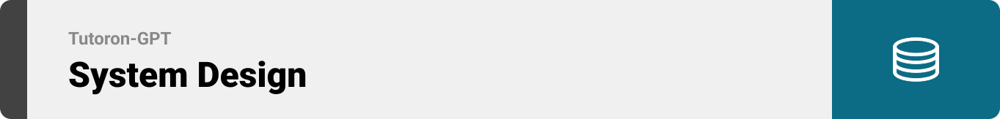

  
<!-- project overview -->

>
>Tutoron-GPT: Your Personal AI Learning Assistant
Paste a YouTube link and Tutoron-GPT instantly pulls the transcript, distills it into a clear summary, and builds a custom quiz to lock in the concepts.
Powered by adaptive AI, it tailors every explanation to your learning style so you grasp ideas quickly and remember them longer.

> 

  

<!-- System Design -->

### Architecture Diagram

Backend Diagram 

 
   

 Front-end Diagram  
 
  

DOCKER Diagram 

  

### Database Diagram

### 🧠 Hybrid Cloud-to-Local Transcript Fetching Architecture

-- **Why:**  
  Cloud VMs like EC2 are often blocked from accessing YouTube transcripts due to IP-based restrictions.

- **The Challenge:**  Fetching YouTube transcripts directly from a server results in failure or empty responses.

- **The Solution:**  Offload the transcript extraction to your **local machine with a residential IP**.

- **How It Works:**   - 🌐 Laravel (on EC2) sends an HTTP POST to a public Ngrok endpoint.  
  - 🧩 Ngrok tunnels the request to your **local Node.js + Express** server.  
  - 🐍 Node.js triggers a Python script (`fetch_transcript.py`) to extract the transcript.  
  - 📬 The response is sent back to **Laravel via a secure HTTP route**, completing the flow.

> ✅ This hybrid architecture enables **fast**, **secure**, and **reliable** transcript access even from cloud-restricted environments.

  

<!-- Project Highlights -->

###  Standout Features That Make Tutoron-GPT Shine

-  **One-link to learning flow**  
 Paste any YouTube URL → auto-grab transcript → AI distills a crystal-clear summary → instant multiple-choice quiz.

  **Auto-Quiz Builder**  
  GPT-4 reads the freshly-pulled transcript, then writes a clean JSON quiz,10+ unique, section-tagged questions with answer keys ready for instant display in the frontend 
  -  **Smart AI Summarization**  
  Structured video breakdowns: Objectives, Key Points, Highlights, and Insights - powered by GPT.

  

<!-- Demo -->

### User Screens (Responsive)
<!-- | Login screen                            | Register screen                       |  Homepage screen                       |
| --------------------------------------- | ------------------------------------- | ------------------------------------- |
| .gif) | .gif )| .gif) |
 -->**Login screen**
.gif) 
**Register screen**
.gif )
**Homepage screen**
.gif)
### user Screen (Web)

<!-- | upload screen                            | Summary screen                       |
| --------------------------------------- | ------------------------------------- |
|  |  | -->

**upload screen**

**Summary screen**
