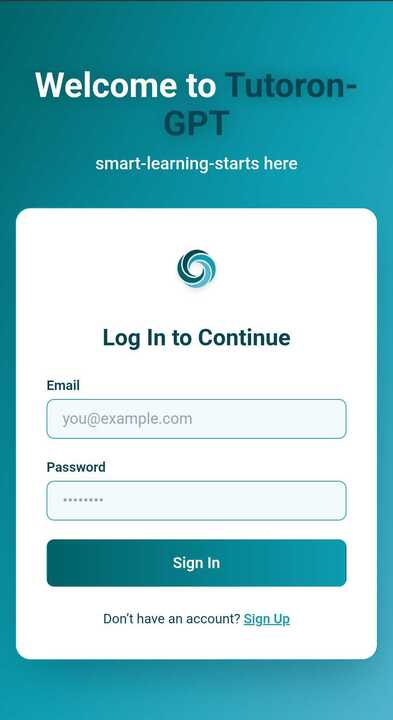

  

<!-- project overview -->

>
>Tutoron-GPT: Your Personal AI Learning Assistant
Tutoron-GPT is an AI-powered education platform designed to revolutionize how individuals learn online. By combining adaptive technology with personalized tutoring experiences, Tutoron-GPT helps users learn faster, understand deeper, and retain longer.

Whether you're a student preparing for exams, a professional upskilling, or a curious mind exploring new topics, Tutoron-GPT tailors its teaching approach to your unique learning style and pace.

> 

  

<!-- System Design -->

### Add Title Here

- Hybrid Cloud-to-Local Microservice for YouTube Transcript Fetching
Offloading transcript extraction to a personal machine with residential IP to bypass YouTube's cloud IP restrictions - using Node.js, Python, and Ngrok as a lightweight, secure bridge between Laravel and local execution.

  

<!-- Project Highlights -->

### Add Title Here

- 📺 YouTube Transcript Intelligence
Upload any YouTube URL  get clean transcripts, summaries, key insights, and study material.
-🌐 Cloud-to-Local Microservice Bridge
Bypasses YouTube transcript blocking with a hybrid Node.js + Python pipeline using Ngrok.
-🧠 Smart AI Summarization
Structured video breakdowns: Objectives, Key Points, Highlights, Insights - powered by GPT.
  

<!-- Demo -->

### User Screens (Mobile)

| Login screen                            | Register screen                       | Homepage screen                       |
| --------------------------------------- | ------------------------------------- | ------------------------------------- |
|  |  |  |

### Admin Screens (Web)

| Login screen                            | Register screen                       |
| --------------------------------------- | ------------------------------------- |
|  |  |

  

<!-- Development & Testing -->

### Add Title Here

| Services                            | Validation                       | Testing                        |
| --------------------------------------- | ------------------------------------- | ------------------------------------- |
|  |  |  |

  

<!-- Deployment -->

### Add Title Here

- Description here.

| Postman API 1                            | Postman API 2                       | Postman API 3                        |
| --------------------------------------- | ------------------------------------- | ------------------------------------- |
|  |  |  |

  
